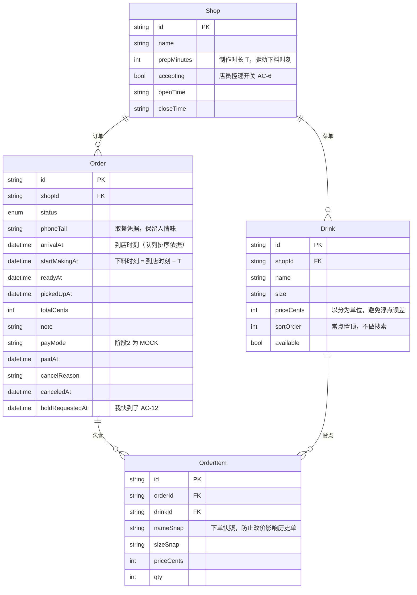
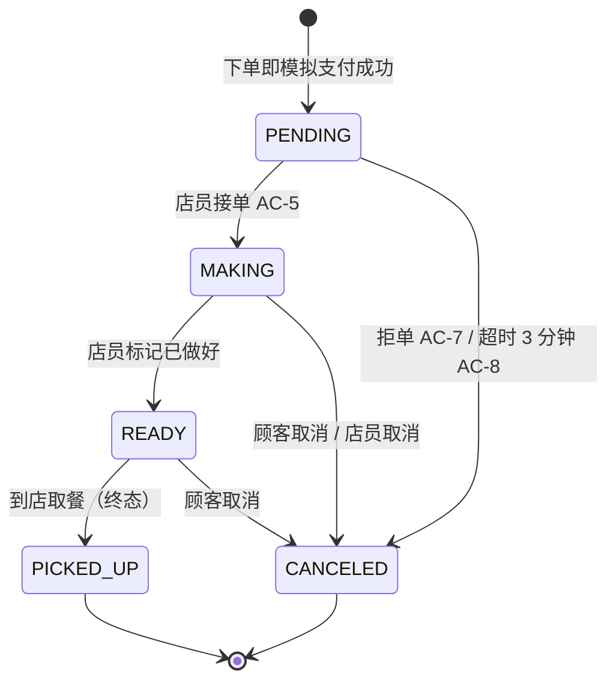
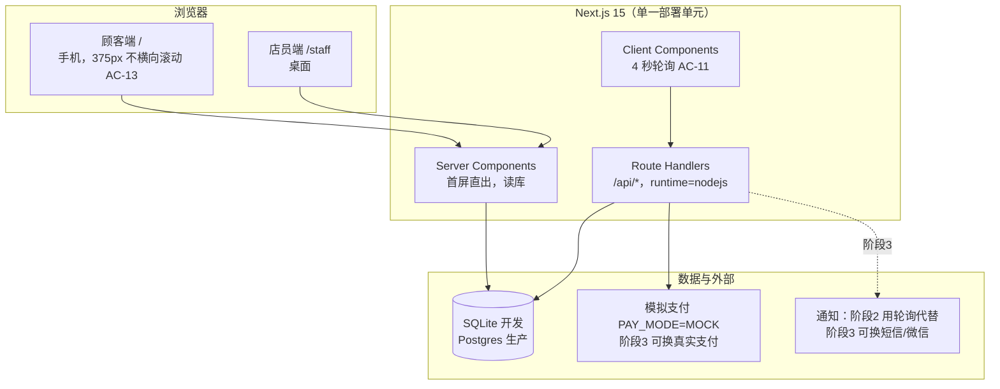

# 技术设计（阶段 2）

> 上游依据：`docs/PRODUCT.md`（阶段 1 产品定义）
> 技术栈：Next.js 15 + TypeScript + Prisma + SQLite（开发）/ Postgres（生产）
> 支付：模拟支付（`PAY_MODE=MOCK`）
> 定稿日期：2026-09-26

---

## 0. 本机环境约束（影响技术选型）

选型不是偏好问题，是被这台机器的实际能力约束出来的。记下来，避免下次重踩。

| 约束 | 表现 | 应对 |
| --- | --- | --- |
| 沙箱禁止 spawn 子进程 | `EPERM`，出现在 pnpm runner、npm postinstall、Prisma schema engine、next build | 已确认可用的命令写在 `SETUP.md` |
| npm 默认缓存在工作区外 | `EPERM: open 'C:\Users\...\npm-cache'` | 固定用 `--cache D:\DeepSeek\.npm-cache` |
| `postinstall` 会触发 rebuild → spawn | 装完包后在最后一步整体回滚 | **已移除 `postinstall`**，改为手动 `npm run db:generate` |
| 直连 github.com 超时 | 网络层阻挡 | 仓库级 `http.proxy` + `http.sslBackend=openssl` |
| 无 Docker / 无本地 Postgres | 无法起容器 | 开发库用 **SQLite**（零安装）；生产再切 Postgres |

**给协作者的一句话**：这套代码在普通机器上就是标准的 Next.js 项目，
本机特有的绕行方案全部写在 `SETUP.md`，不需要读这份文档。

---

## 1. 数据模型

依据 `prisma/schema.prisma`。两个字段承载了本产品的核心机制，必须保留：

| 字段 | 含义 | 为什么不能省 |
| --- | --- | --- |
| `Order.arrivalAt` | 顾客选定的到店时刻，5 分钟粒度 | 店员端队列**按它排序**（AC-5），不是按下单时刻 |
| `Order.startMakingAt` | 下料时刻 = `arrivalAt − shop.prepMinutes` | 承载「按到达时刻倒推下料」这个唯一差异化机制（AC-3） |



**设计取舍**：

- **金额用整数分**（`priceCents`），不用浮点。这是钱相关代码的基本纪律，
  与 `¥15.00` 的显示格式在 UI 层转换。
- **订单项做快照**（`nameSnap` / `sizeSnap` / `priceCents`）。菜单改价后历史订单
  必须保持原样，否则对账时会发现金额对不上。
- **不做多店支持**（`shopId` 保留但只用一个）。见 `docs/PRODUCT.md` 非目标。
- **不建用户表**。取餐凭据是手机号后四位，无需注册——这是 AC-1「30 秒下单」的前提。
  代价是没有账号体系，无法做历史订单列表，本阶段接受。

---

## 2. 订单状态机

全项目唯一的状态真相来源：`src/lib/status.ts`。
**任何状态变更都必须经过 `assertTransition`**，这是 AC-14（终态不可再次流转）的保证。



**`UNPAID` 状态已定义但当前流程不经过它**——模拟支付让订单创建即视为已支付。
保留它是为真实支付接入留位置：届时 `PENDING` 之前会多一步支付回调。

终端状态：`PICKED_UP`、`CANCELED`。进入后 `TRANSITIONS` 表中对应空数组，
从终态出发的任何流转都会抛错。

取消原因枚举：`TIMEOUT` / `REJECT_SOLD_OUT` / `REJECT_BUSY` / `CUSTOMER`。
四种原因在顾客侧的文案各不相同（见 `OrderStatusTracker` 的 `CANCEL_TEXT`），
**不要把取消原因写成自由文本**，否则客服场景无法聚合统计。

---

## 3. API 契约（阶段 2 冻结版）

| 方法 | 路径 | 用途 | 对应验收标准 |
| --- | --- | --- | --- |
| GET | `/api/orders` | 取可选到店时刻 + 店铺接单状态 | AC-2 / AC-9 |
| POST | `/api/orders` | 下单（模拟支付，直接进 PENDING） | AC-1 / AC-2 |
| GET | `/api/orders/:id` | 订单详情 + 预计做好时刻 + 两个倒计时 | AC-3 / AC-11 |
| POST | `/api/orders/:id` | `{action:"cancel"}` / `{action:"hold"}` | AC-4 / AC-12 |
| GET | `/api/staff/queue` | 店员端队列（**按到店时刻排序**）+ 今日统计 | AC-5 |
| POST | `/api/staff/queue` | `{accepting:bool}` / `{prepMinutes:number}` | AC-6 |
| POST | `/api/staff/orders/:id` | `accept` / `reject` / `ready` / `pickup` | AC-5 / AC-7 |

**契约约定**：

- 错误统一返回 `{ error: string }`，中文、可直接展示给顾客，`status` 用语义化 HTTP 码
- 所有写操作都返回更新后的完整订单对象，前端无需二次请求
- `runtime = "nodejs"`：Prisma 不能在 Edge Runtime 运行

**服务端校验清单**（不能只靠前端）：
到店时刻必须是 5 分钟整数倍（AC-2）、不能早于当前时间、后四位必须是 4 位数字、
暂停接单时拒绝下单（AC-6）、单品格数上限 10。

---

## 4. 关键机制：下料时刻的计算与唯一真相来源

```
顾客下单          arrivalAt = 8:30（5 分钟粒度）
                     │
                     ├── startMakingAt = 8:30 − T(3min) = 8:27   ← 下料
                     │
                     └── 预计做好时刻 = 8:30                     ← 顾客看到的
```

**这里有一个必须遵守的约束**：`预计做好时刻` **就等于 `arrivalAt`**，
不要用 `startMakingAt + T` 去反推。虽然数学上相等，但多引入一次计算就多一处
可能与 `shop.prepMinutes` 不一致的地方——这是本项目最容易写出 bug 的位置，
已在 `src/lib/domain.ts` 的 `expectedReadyAt()` 处写明注释。

排队拥挤时的处理：若 `startMakingAt` 已早于当前时刻（说明顾客快到了或已过时间），
接单时把 `startMakingAt` 重置为「现在」，避免写出一个已经过去的制作时刻。

---

## 5. 无后台任务下的超时自动取消

AC-8 要求「超过 3 分钟未接单自动取消」，但这套环境没有后台任务/消息队列。方案：

```
顾客端 GET /api/orders/:id  ─┐
店员端 GET /api/staff/queue  ─┼─► autoCancelStale()
下单前  GET /api/orders      ─┘         │
                                        └─► 扫描 PENDING 且 paidAt < now−3min
                                            逐单流转为 CANCELED(TIMEOUT)
```

- **幂等**：已经流转走的订单不会被二次取消（流转前校验状态机）
- **并发安全**：`transition` 失败直接跳过，不重试
- **局限**：只在有请求时触发。若长时间无人访问，超时订单会滞留在 PENDING，
  顾客下次打开页面时才会被取消
- **生产改法**：接 Vercel Cron 定时调用同一函数即可，业务逻辑无需改动。
  这也是把它写成 `domain.ts` 里的纯函数而不是内联在路由中的原因

---

## 6. 部署图



**部署形态**：单个 Next.js 应用同时承载顾客端与店员端，一个部署单元。
选它的理由是阶段 6 要求「真实可访问 URL」，Vercel 连仓库即可部署，
且前后端同仓不需要处理跨域与双份环境变量。

---

## 7. 代码结构

```
src/
├── app/
│   ├── page.tsx                    顾客端下单页（Server Component）
│   ├── order/[id]/page.tsx         订单状态页
│   ├── staff/page.tsx              店员接单台
│   └── api/
│       ├── orders/route.ts         GET 选项 / POST 下单
│       ├── orders/[id]/route.ts    GET 详情 / POST 取消·催单
│       └── staff/
│           ├── queue/route.ts      GET 队列 / POST 店铺设置
│           └── orders/[id]/route.ts POST 接单·拒单·做好·取餐
├── components/
│   ├── OrderPicker.tsx             顾客端交互（客户端）
│   ├── OrderStatusTracker.tsx      订单状态轮询（客户端）
│   └── StaffConsole.tsx            店员台（客户端）
└── lib/
    ├── status.ts                   ★ 状态机，唯一真相来源
    ├── time.ts                     ★ 下料时刻计算，唯一真相来源
    ├── domain.ts                   业务逻辑，所有流转必经此处
    └── db.ts                       Prisma 单例
```

**分层纪律**：页面和路由**不允许**直接操作状态字段，必须调用 `domain.ts`。
这样 AC-14 的状态机校验才不可能被绕过。

---

## 8. 验证方式与已知局限

**已验证**（`node scripts/smoke.mjs`，20 项全通过）：

| 验收标准 | 验证内容 |
| --- | --- |
| AC-3 | 下料时刻 = 到店时刻 − T；预计做好时刻 = 到店时刻 |
| AC-1 | 订单创建、快照写入、状态为 PENDING |
| AC-5 | 后下单但更早到店的订单排在队列前面 |
| AC-14 | 终态不可流转 |
| AC-7 | 拒单进入终态并记录原因 |
| AC-8 | 超时订单可被检索、取消、且幂等 |
| AC-4 | 2 分钟免费取消窗口边界 |
| AC-6 | 暂停/恢复接单 |

**尚未验证**（需要人工在浏览器里做，列出来避免误以为已完成）：

- AC-1 的「30 秒内完成下单」需要真人计时
- AC-11 的双端实时可见需要两个窗口并排观察
- AC-13 的 375px 无横向滚动需要真机或模拟器
- AC-15 的陌生人独立完成需要真实用户
- 生产构建（`next build`）在本机因 spawn 限制未能验证，需在普通环境或 CI 中跑

**明确的技术债**（不是遗漏，是有意识的取舍）：

1. 无认证：`/staff` 任何人可访问。上线前必须加口令（阶段 3 待办）
2. 轮询而非推送：4 秒间隔，多顾客时请求量线性增长
3. 无历史订单页：没有账号体系
4. SQLite 不适合生产并发写
