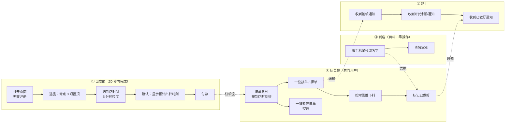

# 产品定义（阶段 1 · v1）

> 上游依据：`PRD.md`（阶段 0 调研，5 顾客 + 1 店员）
> 状态：阶段 1 定稿，可作为阶段 2 技术设计的输入
> 定稿日期：2026-09-26

---

## 0. 决策记录：为什么这样定位

调研推翻了最初的假设，产品定义随之重写。把这条链路写下来，是为了在后续开发里
**不再回头争论「为什么不做成提前点好、到店取走」**——那个形态被证词否定了。

| 原假设 | 调研结论 | 本阶段的决定 |
| --- | --- | --- |
| 核心用户 = 早高峰赶时间的上班族 | 林小姐（日频、步行 8 分钟）明确说不会用：提前点会凉，而排队只要 3-5 分钟 | 核心用户改为**双手被占用者**（带娃 / 拎物 / 陪人） |
| 核心价值 = 省排队时间 | 步行 15 分钟圈内排队本就不长，省时间价值薄 | 核心价值改为**减少操作与决策摩擦** |
| 预点单 = 提前做好 | 提前做好 = 意式咖啡必凉（温度与 crema 流失） | 改为**按到达时刻倒推下料**，下料由「顾客临近」驱动 |
| 店员是阻力方 | 阿凯欢迎高峰预点单，怕的是单集中涌入与熟客人情味流失 | 店员是**共同用户**，产品必须给他「控速」能力 |
| 社区店人情味是次要顾虑 | 阿凯视为核心竞争力与生存问题 | 提升为**硬约束**，不可牺牲 |

**被明确放弃的方向**：面向早高峰通勤族的「出门前点好、到店即取」。这是本阶段
最重要的一个「不做」决定。

---

## 1. 目标用户：一个人，一个场景

不做「面向所有顾客」。只服务一个人群，把一件事做到真能用。

**核心用户 · 陈女士画像**

| 维度 | 描述 |
| --- | --- |
| 身份 | 32 岁，周边小区宝妈，步行 10 分钟 |
| 频率 | 月频 3-4 次带娃路过外带 |
| 场景 | 推婴儿车，手里拿玩具和水壶，娃还会闹 |
| 真实痛点 | 腾不出手翻手机付款；最怕排队，娃站不住到处跑 |
| 现有行为 | 一看人多就直接走，**不买了** |
| 她的原话 | 「最怕排队！娃站不住到处跑……一看人多我就直接走了」 |

**为什么是她，而不是林小姐**

林小姐「等得起」——她的替代方案（现场排队 3-5 分钟）成本可接受，产品对她的增益
只是优化。陈女士「等不起」——她的替代方案是**放弃购买**，产品对她是**排除性需求**。
在只有 48 小时的预算下，必须服务那个「没有产品就发生不了交易」的人。

**次要用户 · 阿凯（店长兼咖啡师）**

他不是被服务的对象，也不是需要被绕开的阻力，而是**共同用户**：产品同时要让他
更省力，且不伤害他的生意根本。他的需求是产品需求，不是产品要克服的障碍。

**本阶段不服务的用户**（写入非目标，见第 5 节）：早高峰纯赶时间的通勤族、堂食办公者。

---

## 2. 一句话价值主张

> **给推着婴儿车、腾不出手的社区店顾客，让他们在路上用 30 秒约好到店时间，
> 到店时咖啡刚好做好、报名字就能拿走——不用排队，也不用掏手机付款。**

关键词逐一的来源：

- 「推着婴儿车、腾不出手」→ 陈女士的痛点，排除性需求
- 「30 秒」→ 不能比现场点单更麻烦，否则她没有理由换
- 「约好到店时间」→ 化解林小姐「提前点会凉」的唯一理由
- 「刚好做好」→ 由到达时刻倒推下料，不是由下单时刻
- 「报名字」→ 保留人情味约束（阿凯认得熟客，叫他名字）

---

## 3. 用户故事地图

按时间轴排列，**纵向切一刀就是一次可交付的迭代**。MVP 只做第 1-4 步。



**MVP 边界：只做 ① 的下单主流程、④ 的接单与控速、③ 的取餐凭据。
② 的三条通知，MVP 只保留「已接单」一条，其余留到打磨阶段。**

---

## 4. 验收标准（可测试，逐条对应 UI 动作）

每一条都必须能由一个**不参与开发的陌生人**执行并判定通过/失败。

| # | 验收标准 | 判定方式 |
| --- | --- | --- |
| AC-1 | 未注册的新用户，从打开页面到下单成功，**不超过 30 秒**、不超过 5 次点击 | 陌生人计时 + 数点击 |
| AC-2 | 下单前**必须**选定「到店时间」，粒度为 5 分钟 | 不选则提交按钮不可用 |
| AC-3 | 下单后页面明确显示「预计 X:XX 做好」，且该时刻 = 到店时间 − 制作时长 | 与店员端下料时刻一致 |
| AC-4 | 顾客能在下单后 **2 分钟内**无理由取消，全额退款 | 取消后订单进入已取消终态 |
| AC-5 | 店员能看到待接单队列，**按到店时刻排序**，且显示顾客到店时间 | 队列第一条应为最早到店者 |
| AC-6 | 店员能一键**暂停接单**，暂停期间顾客侧下单被阻止并给出明确提示 | 暂停时下单按钮变为不可用 + 文案说明 |
| AC-7 | 店员能一键**拒单**，拒单原因可选（售罄 / 忙不过来），订单立即全额退款 | 拒单后顾客收到通知且状态为已取消 |
| AC-8 | 订单超过 3 分钟未被接单，**自动取消并退款**，并通知顾客 | 用系统时间推进验证 |
| AC-9 | 确认页显示温度提示：「请选择接近您到店的取餐时间」 | 文案存在且可读 |
| AC-10 | 支付可用测试模式完成；**无任何密钥硬编码在源码中** | 搜索源码无 token/密钥 |
| AC-11 | 订单状态变更为已接单 / 已做好时，顾客侧 **30 秒内**可见 | 两侧页面并排观察 |
| AC-12 | 顾客可一键「我快到了 / 请帮我留一下」 | 店员侧收到显著提示 |
| AC-13 | 移动端 375px 宽度下，主流程**无需横向滚动** | 手机或浏览器模拟器 |
| AC-14 | 订单状态机有明确终态，**不允许从终态再次流转** | 尝试对已取消订单接单，应失败 |
| AC-15 | 全流程 demo 无需开发者解释，陌生人可独立完成 | 录屏观察 |

---

## 5. 非目标（本阶段明确不做）

写下来是为了防止范围失控——每一个「不做」都有调研依据。

- **不做堂食预约占位**：顾客 2 张先生来店是为了放松和跟老板聊天，预约座位会改变店铺性质
- **不做多人拼单**：顾客 3 小周的拼单需求很有价值，但需要未发生场景验证，留到下一迭代
- **不做会员积分与储值**：与「减少操作摩擦」的核心价值无关
- **不做搜索与复杂菜单分类**：SKU 只有十余项，**常点 3 项置顶**比搜索更省操作
- **不做配送**：这是到店场景，配送会引入完全不同的履约模型
- **不做多店支持**：单店运营，多店会让数据模型和权限设计复杂度翻倍
- **不做早高峰通勤族专用优化**：已被调研否定，见第 0 节

---

## 6. 低保真线框

### 顾客端 · 下单页（核心屏，对应 AC-1、AC-2、AC-9）

```
┌─────────────────────────────┐
│  巷口咖啡                    │
│  ─────────────────────────  │
│  常点（为你置顶）            │
│  ┌───────────────────────┐  │
│  │ 中杯 冰美式      ¥15  │  │
│  │         [ − ] 1 [ + ] │  │
│  └───────────────────────┘  │
│  ┌───────────────────────┐  │
│  │ 中杯 燕麦拿铁    ¥20  │  │
│  │         [ − ] 0 [ + ] │  │
│  └───────────────────────┘  │
│                             │
│  其他饮品              展开 >│
│                             │
│  ─────────────────────────  │
│  到店时间（必选）            │
│  [8:25] [8:30] [8:35] [8:40]│
│  ⓘ 请选择接近您到店的取餐时间 │
│                             │
│  ─────────────────────────  │
│  预计 8:30 做好             │
│  合计 ¥15                   │
│  ┌───────────────────────┐  │
│  │      确认并支付        │  │
│  └───────────────────────┘  │
└─────────────────────────────┘
```

### 店员端 · 接单台（对应 AC-5、AC-6、AC-7）

```
┌──────────────────────────────────────┐
│  接单台           [ ⏸ 暂停接单 ]      │
│  ──────────────────────────────────  │
│  待接单 (2)                           │
│  ┌────────────────────────────────┐  │
│  │ 8:30 到店   中杯冰美式 ×1      │  │
│  │ 尾号 4213   下单于 8:12        │  │
│  │      [ 接单 ]   [ 拒单 ▾ ]     │  │
│  └────────────────────────────────┘  │
│  ┌────────────────────────────────┐  │
│  │ 8:35 到店   燕麦拿铁 ×2        │  │
│  │ 尾号 8890   下单于 8:14        │  │
│  │      [ 接单 ]   [ 拒单 ▾ ]     │  │
│  └────────────────────────────────┘  │
│  ──────────────────────────────────  │
│  制作中 (1)                           │
│   8:28 到店  中杯冰美式 ×1  [已做好]  │
│  ──────────────────────────────────  │
│  今日已接 7 单 · 已拒 0 单            │
└──────────────────────────────────────┘
```

**设计要点**：队列按「到店时刻」排序而非「下单时刻」——这是本产品的核心机制，
决定了店员的下料节奏。默认视图必须让最早到店的那一单在最上方。

---

## 7. 核心机制：为什么是「到达时刻预约」

这是本产品唯一真正区别于普通点单小程序的地方，值得单独说明。

```
普通预点单：  下单时刻 ──► 立即下料 ──► 顾客到店时咖啡已放置 N 分钟 ──► 凉
本产品：      下单时刻 ──► 排队 ──► 到店时刻前 T 分钟下料 ──► 顾客到店即取 ──► 刚好
```

- `到店时刻` 由顾客选定（5 分钟粒度）
- `制作时长 T` 由店员端配置，MVP 可先用固定值
- 顾客看到的「预计 X:XX 做好」= `到店时刻 − T`，必须与店员端下料时刻一致（AC-3）

这条机制同时满足三方：陈女士不用等、不腾手；阿凯能规划下料节奏不被单子打乱；
林小姐式的顾客即使不用，也不会因为产品存在而被迫接受一杯凉咖啡。

---

## 8. 待验证假设（诚实标注，防止当成事实）

| 假设 | 现状 | 验证方式 |
| --- | --- | --- |
| 「双手被占用」是排除性需求 | 仅 2 人提及，样本薄 | 上线后统计该类用户的下单完成率 |
| 顾客愿意为「准时」而牺牲「随到随点」 | 未验证 | 观察下单时间分布是否聚集在高峰 |
| 店员能接受按到达时刻倒推的排产方式 | 未验证 | 让阿凯实际用一次，记录他是否按队列顺序下料 |
| 30 秒内完成下单可实现 | 未验证 | AC-1 的实测结果 |

**这份定义是探索性结论，不是已证实的定论。** 任何一个假设被推翻，都需要回到第 1 节
重新选择目标用户——而不是在产品里加功能去补救。

---

## 9. 下一步（阶段 2 技术设计的输入）

本文件确认后，阶段 2 需要产出：

1. **数据模型**：顾客、商品、订单、订单状态流转、店员配置
2. **订单状态机**：待支付 → 已支付待接单 → 制作中 → 已做好 → 已取餐，加 已取消 / 已拒单 两个终态
3. **API 契约**：下单、接单、拒单、暂停接单、状态查询、取消退款
4. **部署图**：前端 / 后端 / 数据库 / 支付 / 通知的边界
5. **可运行骨架**：能在本地跑起来并 push

**契约一旦定稿就不要随口改**——这是本项目 vibe coding 的硬纪律之一。
